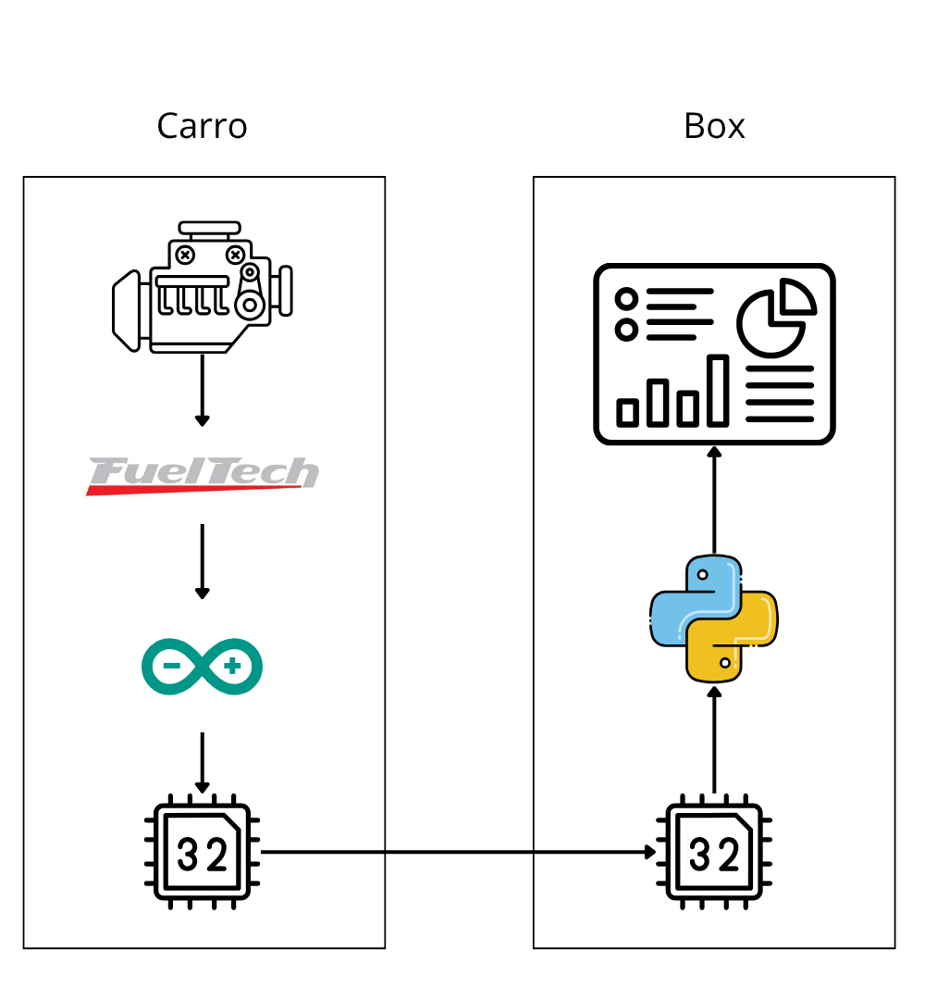

# Telemetria

## Carro
### Conexões do Arduino
Ele é o micro controlador responsável por receber as informações diretamente dos sensores e do MCP2515. Nele será conectados também o sensor de temperatura do arrefecimento e o sensor de temperatura IR.
Ele fará a comunicação com o Lora-32 por meio de UART (Pinos RX e TX).

### Conexões do Lora-32
O Lora-32 recebe as informações ja previamente filtradas e tratadas do Arduino. Ele é responsável por manter a comunicação com o box por meio do protocolo LORA (Long Range).

### Pinagem CAN
Para a conexão do FT550 com o MCP2512 é necessário os cabos em CAN H e CAN L. Can High é o pino do meio da linha superior do conector B, enquanto o Can Low é o pino ao lado, localizando-se mais próximo a extremidade se comparado ao seu antecessor.
É válido dizer que o Arduino está preparado para ler os valores enviados na configuração FTCAN 2.0.

## Box
### Lora-32
Recebe as informações do carro e envia de forma ainda mais enxuta por meio de UART para o computador.

### PySerial
PySerial é um framework em python que possibilita fazer a leitura da porta COM. A partir disso conseguimos receber os dados do Lora e enviar para o Dashboard.

### Django
Django é um framework em python para desenvolvimento WEB.
As informações recebidas pelo PySerial são armazenadas em um Json. O dashboard faz requisições para ler o Json constantemente (tendo em vista que é esperado uma atualização a cada 50ms) para que seja atualizado no dashboard.

## OBS
Ao invés de fazer a comunicação por HTTP (Custosa para o computador) é possivel utilizar um WEB Socket (Consideravelmente mais leve), mas demanda um certo tempo para entender a sua utilização e mais ainda para aplicar, portanto, como o prazo é curto, mantemos o HTTP